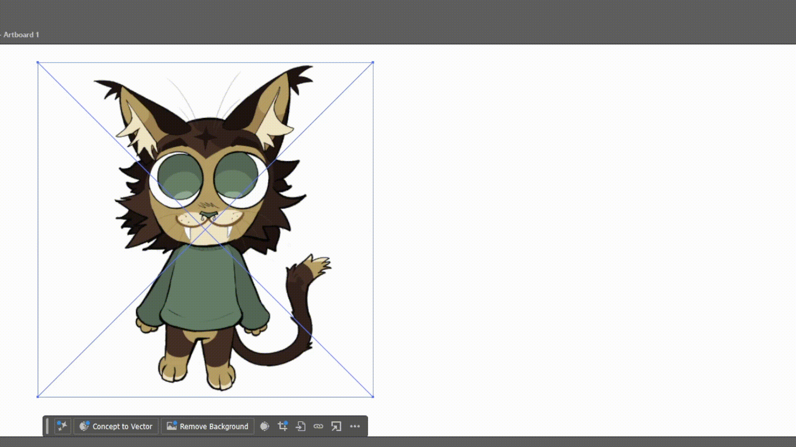
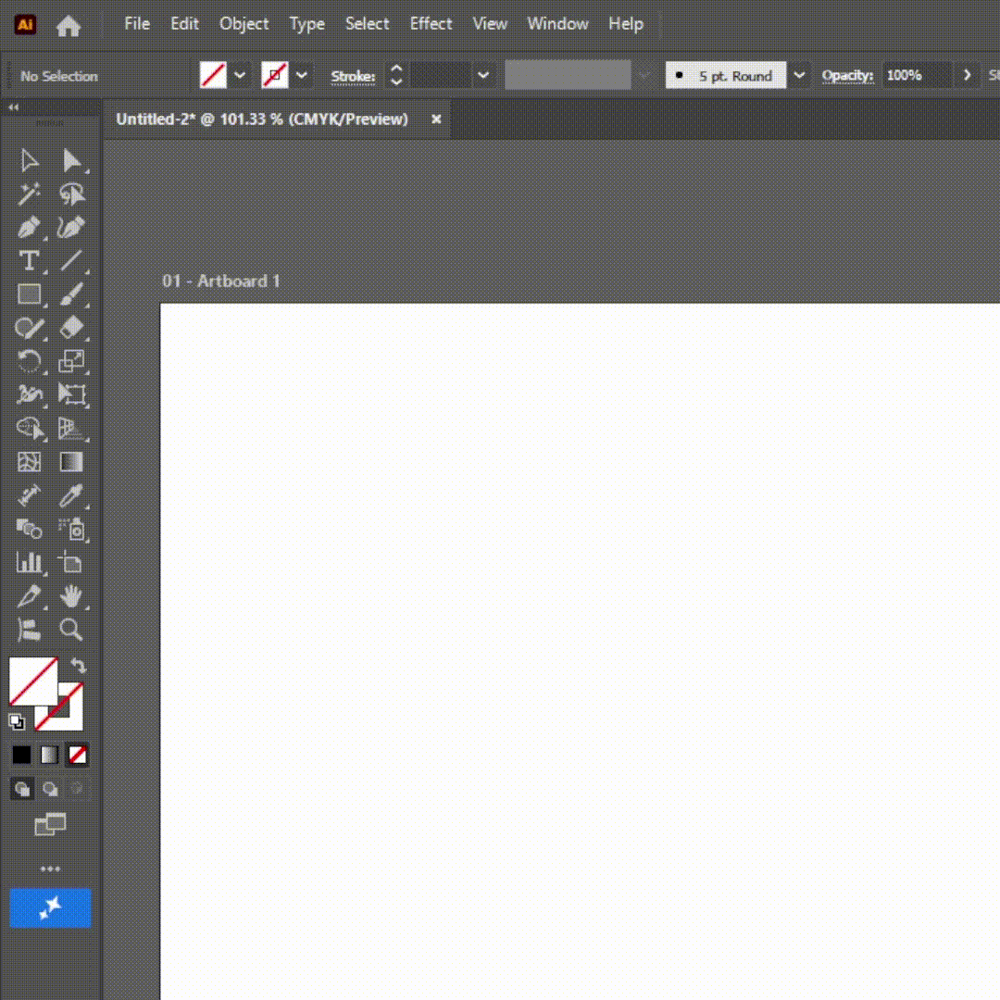
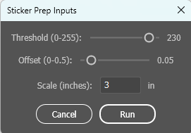

# UCSC Slugworks Printer-Cutter Ready Script 

A script that given any raster image inputted in Adobe Illustrator, creates a cut contour and prepares an image for sticker printing. 

Specifically made for UCSC students working with the Roland BN20A print-cut printer

## Highlights

- Uses a raster image and creates a cut contour line for a Roland BN20A print-cut printer!
- Easy use in Adobe Illustrator

## Authors

I'm [GalaGuard](https://github.com/GalaGuard), a CS student at UCSC and a digital artist. 

## Usage

**Simply access the "Script" dropdown from "File" or press CTRL + F12 and select the script file**

## Installation

>### Use only for Adobe Illustrator 

>#### To permanently add the script in the "Scripts" dropdown, navigate to: 
>
>>C:\Program Files\Adobe\Adobe Illustrator [Version]\Presets\[Your Language]\Scripts (**Windows**)
>
>>Applications / Adobe Illustrator [Version] / Presets / [Your Language] / Scripts (**macOS**)

1. Download the file "sticker_script.jsx"
2. Access the script dropdown in Adobe Illustrator through Files (Files->Script->Other Scripts) or press CTRL + F12
3. Select the "sticker_script.jsx" from where you downloaded it
4. Select what values you want (threshold, path offset, size) and press run
    - Threshold: For image trace
    - Offset: For the offset of the cut contour path
    - Scale: size of the image in inches

 

## Contributing

- If you'd like to edit this project, improving on it or adjusting it, feel free to fork the code!